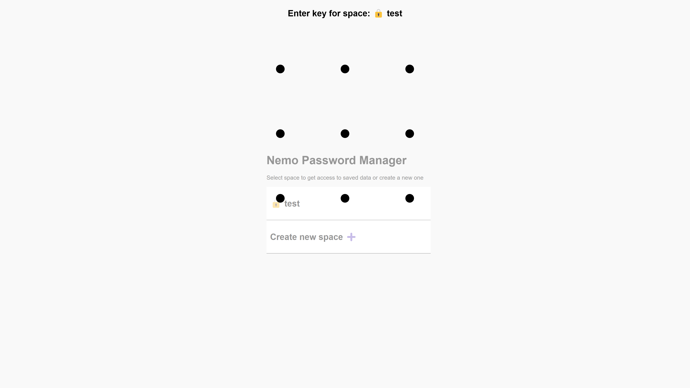

# Nemo Password manager



## Description

Nemo Password manager is a self-hosted password manager that allows you to store and manage your passwords, credit cards, and keys securely. It is designed to be easy to use and provides a simple interface for managing your passwords within strong encryption and keys management.

## Features
- Store and manage passwords, credit cards, and keys securely
- Encrypted spaces
- Graphic lock

# Installation

## Self-hosted

Clone the repository and install the dependencies:

```bash
npm install .
```

Create .env file and set the required environment variables:

```bash
cp .env.example .env
```

```dotenv
# Master access key. Used to access to the API and to encrypt/decrypt the data
API_ACCESS_KEY=your_api_access_key

# API URL
PORT=3000
HOST=localhost
```

## Clouflare Workers (Wrangler)

1. Install Wrangler CLI:
2. Create database:
```bash
wrangler d1 create nemo-password-manager
```

3. Import the database schema:
```bash
wrangler d1 execute nemo-password-manager --file ./schema.sql
```

4. Copy provided database data to wrangler.toml
5. Deploy the project:
```bash
wrangler deploy
```

